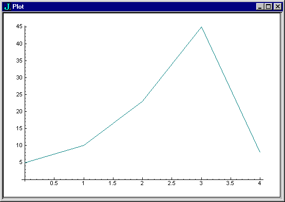

# Primer contents      [Title](#j-primer)

# J Primer


**Eric Iverson**

Copyright © 1991-2011 Jsoftware Inc. All Rights Reserved.  
Last updated: 2001-3-29  
[www.jsoftware.com](www.jsoftware.com)  

# Start Here

J is a general purpose, high-level programming language. If you are new to J and want to be a J programmer, this is a good place to start. Even if you have considerable programming experience, there is much that is unique to J, and it is worthwhile to at least skim this book before jumping into the deep end.

# Why J
J is a very rich language. You could study and use it for years, and still consider yourself a beginner. This is in sharp contrast to simpler languages like Basic or Java, where months of concerted study and use would make you an expert. The effort required to become an expert J programmer is closer to that required to become an expert C++ programmer.

The good news is that the essence of J is so simple and consistent, that you can quickly learn enough to start solving real and interesting problems.

It is easier to learn enough Basic or Java to solve trivial problems, but it is easier to learn enough J to solve more interesting and challenging problems. And once you have that level of skill under your belt, you are not at the end of the road, but can continue to improve, making yourself a better and more formidable programmer.

J is particularly strong in the mathematical, statistical, and logical analysis of arrays of data. It is a powerful tool in building new and better solutions to old problems and even better at finding solutions where the problem is not already well understood.

As well as being a general purpose programming language, the J system also provides:

- an integrated development environment

- standard libraries, utilities, and packages

- a form designer for your application forms (windows)

- an event-driven graphical user interface to your application

- several methods of interfacing with other programming languages and applications

- rapid application prototyping and development

- royalty-free distribution of run-time versions of your application

If you are interested in programming solutions to challenging data processing problems, then the time you invest in learning J will be well spent.

# Purpose of this book
The J Dictionary is the authoritative and definitive specification of the J language. It can be used to learn J, but the fact that it covers all of the language concisely, yet completely and rigorously, with more emphasis on the complex than the mundane, does scare some of us away.

This online book provides a kinder, gentler start for beginners. This book takes you along a path in easy steps to the point where you can write an application in J. Along the way you will be introduced to all the key ideas in J by seeing them in simplified and specific contexts. At the end, you will be able to write real programs in J, and you will also be comfortable in using the J Dictionary as a reference for your work as a J programmer. The purpose of this online book is to get you up to speed where you can use the J Dictionary in a manner that makes you wonder why you ever bothered with this simple stuff.

You should be able to work your way through this book fairly quickly, and at the end you will be an entry-level J programmer. As such, you will have far more programming power at your fingertips than even the most experienced Basic or Java programmer.


# Your background
This online book assumes that you are familiar with another programming language such as Basic, Java, or C. However, this is not a prerequisite, and you shouldn't have particular problems if J is your first computer language (in fact, congratulations!).

Most things can be done in J much as they are done in other languages, and in several areas a topic is introduced just as it would be introduced in other languages. If you are familiar with other languages this makes it easier to follow how it works in J. In some cases there is a much better J way to solve a problem, and that is also covered.


# How to use this book
The online book is a series of small, bite-size sections that are intended to be read in order from the start to the end. Sections typically depend on most or even all of the previous sections having been read. Jumping around is pointless and likely frustrating.

The book is self-contained and could be read without access to a system. In particular, examples of interactions with the J system show both what you enter and how the system responds. However, it is intended to be read with access to a system and with as much use of a system along with the book as possible. It is strongly recommended that you eventually type in all the examples and play around as much as you can with variations on them.

Sometimes a section uses terms and concepts that aren't defined until later. This requires you to proceed with a soft understanding the first time through that becomes more concrete on a second reading.

This book is probably best read by reading it three times:

- Skim the whole book. Try some examples, but it is better to just plow on and get the big picture.

- The second time read it carefully and try all the examples.

- The third time try your own examples to clarify your understanding and to increase your comfort with the mechanics of actually using the system (instead of just reading about it and following instructions).

# Get started
Double-click the J icon to start J. The session opens with a window labeled n.ijx (for example, 1.ijx).

The ijx window is an execution window. You type J sentences into the ijx window and J executes them when you press enter and displays the result.

Type the following line into the ijx window and press Enter.
```J
   2 + 3
```
The sentence is executed and the result is displayed. Type the following line and press Enter.
```J
   5 - 3
```
Your session should look something like this:
```J
   2 + 3
5
   5 - 3
2
```
Lines you enter are indented three spaces and the J answers start at the margin.

# Experiment
You are encouraged to experiment. Try entering similar lines with different numbers. It is clear that `+` is plus and `-` is minus. Enter lines that use `*` for times and `%` for divide. From using `%` you will pretty quickly see that numbers such as `2.5` can be the result, and that they can also be used as arguments.

Until you have more experience, you might sometimes be surprised or even disconcerted by what you observe. Take things in small steps. Try examples where you are pretty sure you already know the answer, and do the experiment to confirm your understanding. If a result puzzles you too much, don't spend time on it in these early stages.
```J
   3 - 5
_2
```
The `_2`, instead of `-2`, might confuse you. Don't worry, it will be explained in a bit.

Most examples in this book show what you should type, indented by three spaces, and also show the result the system displays. This means that you can read the book in a casual manner, without having to use the system to see results. However, the only way you will really learn is by eventually trying the examples and experimenting with your own. Examples are shown in a fixed-pitch font much as they would appear in the ijx window of your system. A larger font is used in some examples to make it easier for you to read and type the example into the system. This is done where you might mistype something because of being unfamiliar with some of the words, or where a typo could have confusing results.

While experimenting, you frequently want to execute minor variations on sentences you have already tried. There are several shortcuts that make this easier. In the ijx window you can move the cursor to any line in the window and press Enter to recall that line as a new line at the bottom of the window ready for editing. You can recall previous input lines for editing by holding down Shift+Ctrl and pressing the up arrow key until you see the line you want to work with.

The examples in most sections are self-contained, but a later part of a section might depend on steps taken in an earlier part. A few sections depend on steps taken in previous sections, but this should be fairly obvious.

# Standard profile
The examples assume that your system runs the standard profile when it is started. This configures your system and makes some standard utilities available.

Enter `CR` (capital letter `C` followed by capital letter `R`) into the ijx window as a quick check on whether the profile has been run.
```J
   CR
```
If the result is a blank line, then profile has been run and you can skip the rest of this section.

If instead you see:
```J
   CR
|value error
```
you will have to change your system so that the standard profile is run. A normal J install is always configured to run profile.

# Terminology
All programming languages have things in common with the English language. Where the analogy is close, J tends to use English language terms in preference to terms used in math and other programming languages.

You could, as in other languages, say line of code, but in J you tend to say sentence instead. Similarly you could refer to the + function, but you usually say verb.

Some English language terms used in J are: alphabet, word, sentence, verb, noun, adverb, and conjunction.

There are several reasons for this approach. One problem it deals with is the plethora of related, but subtly different, uses of traditional terms in math and numerous programming languages. For example: function, subfunction, operator, program, routine, and subroutine are all used in slightly different ways in different programming languages. Rather than inherit this confusion, J adopts its own terms, and defines them precisely within its context.

Using English terms gives you a good idea of what the general meaning of the term is in J. In addition, using natural language terms encourages and facilitates taking the English statement of a problem and more directly writing the corresponding J sentences.

The use of the J terms is encouraged, but certainly isn't mandatory, and using the term function instead of verb is quite OK.

# Alphabet
The J alphabet is the ASCII alphabet and consists of:
```J
26 lowercase letters (a to z)
26 uppercase letters (A to Z)
0 1 2 3 4 5 6 7 8 9
 = < > _
 + * - %
 ^ $ ~ | 
. : , ;
# ! / \
[ ] { }
" ` @ & ?
( )
'
```
There are a few characters that sometimes cause confusion. The `-` (minus) character is different from the `_` (underbar) character and there are three different quote characters:
```J
'  quote
"  double-quote
`  back-quote
```
If you try an example and type " (a double-quote) instead of '' (two quotes) you will be disappointed that your result is not the same as in the book.

The . (period) is usually called dot.

# Word
A word is a group of characters from the alphabet that has a meaning.
```J
   2.5 + 5
```
The sentence has three words: the number `2.5`, the `+`, and the number `5`.

The rules for forming words from the characters in a sentence are simple, and for now, common sense will suffice in recognizing the words in a sentence. There are some complications that will be dealt with in later sections.

# Sentence
A sentence is a group of words that form a complete instruction. Unlike English sentences, J sentences do not end with a period or other punctuation mark. Instead a J sentence is usually a complete line.

# Verb
In the following sentence `+` is a verb (a word that expresses an action).
```J
   2 + 5
```
# Noun
In the following sentence the numbers 2 and 5 are both nouns.
```J
   2 + 5
```
# Number
The following are numbers: 0 1 2 2.5 12.75 0.5 7e6

Enter these, and other numbers, in simple sentences with the verbs `+ - *` and `%`.
```J
  2 * 12.75
25.5
```
An important rule is that a number does not start with a dot.
```J
  0.5
0.5
   0.5 + 3
3.5
   .5
+-+-+
|.|5|
+-+-+
   .5 + 3
|syntax error
|        .5+3
```
Clearly `.5` is not the same as `0.5`. You don't need to know now what `.5` is yet, but it is important to understand that a number does not start with a dot.

The `_` (underbar) is infinity and is a number.

# Negative number
A negative number is indicated by a `_` (underbar), not a `-` (minus).
```J
   5 + _3
2
   _7
_7 
   _5e_3
_0.005
   5 - 9
_4
```
Leaving out the blank between the `-` and the `9` does not change the meaning.
```J
   5 -9
_4
```
The `-` is always a verb. This simplifies the rules for evaluating sentences as there is no special case for `-` when it is used immediately to the left of a number. But if `-` is always a verb, then another character, the `_` (underbar) is required to spell a negative number.

The `_` is used in spelling numbers, along with the digits, dot, and the e for exponential notation; it indicates a negative number.

Remember: `_` in front of a number is part of the number and indicates that it is negative, and `-` is always a verb and is not part of a number.

The `__` (two underbars) is negative infinity and is a number.

# Primitive
A primitive is a word that is defined by the system. For example, `+` is a primitive. The meaning of a primitive is fixed and cannot be changed.

A primitive is spelled with a graphic character (such as `+`) or with a graphic modified by an inflection (a dot or colon), as in `+.` or `+:` .

A primitive is also spelled by one or more letters followed by a dot or colon. For example, `i.` is a primitive that is called index or index of depending on how it is used.

# Name
Whereas a primitive is a word defined by the system, a name is a word defined by you. The primitive `=.` defines a name.
```J
   v =. 23
```
The sentence can be read as `v` is `23`. The word `=.` is called copula (another good English language term). The name `v` is defined as the number 23 and can be used in other sentences.
```J
   5 + v
28
```
Unlike a primitive, a name can be redefined.
```J
   v =. 45
   5 + v
50
```
The system does not display the result of the sentence when it begins with a copula. A sentence that contains only a name shows a display form of the definition of the name.
```J
   abc =. 123
   abc
123
```
You can give anything a name. For example, you could give a name to the verb `+` .
```J
   plus =. +
   23 plus 45
68
```
The preferred way to read `abc =. def` is: `abc` is `def` or `abc` is defined as `def`. However, borrowing from other computer languages, it is also common to say: `abc` is assigned the value `def` or the value `def` is assigned to `abc`.

# Comment
The primitive `NB.` starts a comment that runs to the end of the line.
```J
   2 + 23   NB. this is a comment and is not executed
25
```

# Error
An error in a sentence is reported and the execution stops.
```J
   123 foo 234
|value error
|   123     foo 234
```
A vertical bar marks the error report. When appropriate, the sentence is displayed with extra spaces marking where the error was detected.

# Ambivalence
Every verb has two definitions: a dyad used when it has both a left and right argument, and a monad used when it has only a right argument. The two definitions are usually related, as in - with a dyad definition of minus and a monad definition of negate.
```J
   5 - 3
2
   - 7
_7
```
The dyad is also referred to as the dyadic case of the verb and the monad is referred to as the monadic case of the verb.

The term ambivalence is used in the chemical sense of both valences to indicate that a verb can react with both a single argument and with two arguments.

Remember: every verb has both a monad and dyad definition.

# Dyad
The dyadic case of a verb is used if the verb has both a left and right argument.

The dyad `%` (divided by) is defined as the left argument divided by the right argument.
```J
   5 % 2
2.5
```

# Monad
The monadic case of a verb is used if the verb has only a right argument.

The monad `%` (reciprocal) is defined as 1 divided by the right argument.
```J
   % 2
0.5
```
The relationship between the monad `%` and dyad `%` where the monad is the dyad with a fixed left argument is quite common, and you will see this in a number of the other primitive verbs.

# Vocabulary
The J Dictionary (menu Help|Dictionary) is the J reference book and is your ultimate, authoritative source of information on J. The sooner you become familiar with using it the better, and a good way to start is by looking up the primitives that have been introduced so far.

Press F1 to show the vocabulary and click a primitive to jump to the entry. If you press F1 while holding down Ctrl you get context sensitive help. If the caret is at a `+`, pressing Ctrl+F1 will jump to the `+` entry.

In the vocabulary take a look at the row for `+`, which is the fifth row. The first entry in this row contains: `+` Conjugate `o` Plus. The word `+` is a verb and its monad is called conjugate, and its dyad is called plus. The dyad `+` is plus as defined in arithmetic.

The monad `+` is interesting. In math, the conjugate of a complex number is the number with the same real part and an imaginary part of opposite sign. On real numbers the conjugate has no effect and the result is the argument, and on complex numbers it changes the sign of the imaginary part. J supports complex numbers just as directly as integers or real numbers. A complex number is indicated by a j separating the real and imaginary parts.
```J
   int =. 23
   + int
23
   float =. 23.5
   + float
23.5
   imagine =. 2j3    NB. 2 real part, 3 imaginary part
   + imagine	     NB. change sign of imaginary part
2j_3
```
Many primitives support complex numbers and the J Dictionary must document this, which means there is a bit of extra complexity in some of the descriptions. If you need complex numbers in your application this is fantastic. But if you are a beginner and are not concerned with complex numbers, then you have to know enough to be able to ignore these bits and not get distracted or confused.

Let's look at the `+` Dictionary page. The header line of the page gives the monad name Conjugate on the left side, and the dyad name Plus on the right. The formal name of the primitive `+` is near the center. The `0 0 0` to the right of the `+` will be explained later.

Below this header are two boxes. The left box has the monad definition and the right box has the dyad definition. The page then continues with general discussion and examples.

The J Dictionary is a concise, rigorous, and complete reference suitable for the most experienced users. This can make it difficult for beginners who don't know what to expect. For example, in the general discussion and examples for `+` there is considerable discussion of complex numbers and not a single example of just adding a couple of integers. Great for the experienced user who would be insulted if told how to add integers, but a bit of a reading challenge for the real beginner. You have to learn how to tune out, for now, the bits that are too advanced or are not relevant to your current interest, and concentrate on the parts that are.

Go to the vocabulary page and take a look at the `+.` entry (fifth row, second entry) which contains: `+.` Real/Imaginary o GCD (Or). There is a lot of information here, and again much of it is not relevant at this early stage. Let's look at the definition.

Glance at the left box for the monad definition and notice that it is for complex numbers. File it for future reference, but give it a pass for now.

The dyad case in the header is described as: GCD (Or). This gives two informal names, GCD and Or, and indicates it can be used in two different ways. The dyad definition is in the right box. Note that GCD stands for greatest common divisor (which should at least ring a bell of math memories). Further on in the definition you will find that if the arguments are boolean then the `+.` is the logical or function. The GCD is a useful extension of the domain of the or function to non-boolean arguments. This extension of the domain of primitives is common in J. For now, it is interesting to note that `+.` has this larger domain, but it is also easy to limit it to boolean arguments.
```J
   0 +. 0	NB. 0 or 0
0
   0 +. 1
1
   1 +. 0
1
   1 +. 1
1
```
The vocabulary page entry for `+:` contains: Double o Not-Or. The definition page gives quite simple definitions for both the monad and dyad.

The monadic case is called double and does just what you'd expect.
```J
   +:  3
6
```
The dyadic case is the logical negation of the or of the arguments.

Again, for both `+.` and `+:` much of the general discussion and examples are perhaps beyond your capabilities right now. But the key is to know how to navigate and to get the information that is relevant.

After the row for `?` there are additional rows for primitives that are spelled with names that are inflected with a dot or colon.

# Checkpoint A
At this point you should understand:

  - how to use the J Dictionary vocabulary
  - terms such as word, sentence, noun, verb, ambivalence, dyad, monad
Check your understanding by doing the following exercises:
  - look up the definition of the monads `+: *: -: %:`
  - experiment with these new monads

# Numeric constant
You have seen the use of single numbers. It is also possible to have a list of numbers.
```J
   num =. 5
   nums =. 23 0.5 12.5 7e6 _12 7
```
You'll do lots more with numeric lists, but for now we just want to establish that there is such a thing.

# String
Characters bracketed by quotes create a string.
```J
   char =. 'Q'
   chars =. 'this is a list of characters' 
```
The quotes are not displayed when the string is displayed.
```J
   char
Q
   chars
this is a list of characters
```
The quote starts and ends a string. A pair of quotes indicates that the quote character itself is in the string.
```J
   'put 2 ''s to get 1 '' in the string'
put 2 's to get 1 ' in the string
```
An unmatched quote is an error.
```J
   abc =. 'asdf
|open quote
|   abc =. 'asdf
|          ^
```
A string can be empty.
```J
   abc =. ''
   ```
A string is also referred to as a literal constant or as a character constant.

# Word formation
The monad `;:` can be useful in figuring out what the words are in a sentence. The word formation primitive takes a string as its right argument, splits it into words, and returns a result with each word in a box. For now, don't worry about what the boxes are, just note how visually helpful they are. You'll learn about boxes in later sections.
```J
   ;: '2 + 3'
+-----+
|2|+|3|
+-----+
   ;: '2.5 + 3e4'
+---+-+---+
|2.5|+|3e4|
+---+-+---+
   ;: 'a =. 1 2 3'
+-+--+-----+
|a|=.|1 2 3|
+-+--+-----+
   ;: 'test + 123 NB. this is a comment'
+----+-+---+---------------------+
|test|+|123|NB. this is a comment|
+----+-+---+---------------------+
   ;: 'def =. ''testing 1 2 3'''
+---+--+---------------+
|def|=.|'testing 1 2 3'|
+---+--+---------------+
```
Note that the following are all J words and each goes in its own box:
```J
2.5
3e4
=.
1 2 3
test
NB. this is a comment
'testing 1 2 3'
```
It might surprise you that constants such as `1 2 3` and `'testing 1 2 3'` are J words. This is an important point and understanding it is necessary in reading and writing J sentences.

If you are ever puzzled by a J sentence (it could happen), one of the things you can do is apply `;:` to it to be sure you know the words. You can then worry about the meanings of those words.

Look up `;:` in the J Dictionary. The informal name for `;:` is word formation.

# Space
Spaces are not required to separate primitives from other words. On the other hand extra spaces don't change the meaning.
```J
   2+3
5
   2 + 3
5
   2    +    3
5
```
Most examples in this book have spaces around all primitives. This makes the individual words stand out and allows you to concentrate on the meaning of the words without the additional problem of first figuring out what the words are.

However, most J programmers, as they become more experienced, reach a point where they can easily read the words in a sentence, and the extra spaces become a nuisance and hindrance to understanding, rather than an aid. You will notice that in some of the later examples that some of these unnecessary spaces are left out.

There are some cases where a space is essential.

A space must separate names.
```J
   a=.3
   plus=.+
   a plus a
6
   aplusa
|value error
```
The `.` (dot) and `:` (colon), used as inflections, change the word immediately in front of them into a new word. When used as a primitive or as the start of a primitive, they must have a space in front so that they are not treated as an inflection.
```J
   ;: 'a . b'	NB. 3 words
+-+-+-+
|a|.|b|
+-+-+-+
   ;: 'a .b'	NB. same 3 words
+-+-+-+
|a|.|b|
+-+-+-+
   ;: 'a. b'	NB. 2 words
+--+-+
|a.|b|
+--+-+
```
A space must separate a `.` or `:` , that is not being used as an inflection, from the previous word.

Numbers, for example 1e7, can contain letters. There are in fact several letters that can be used in spelling numbers in J. Letters that immediately follow a number are treated as part of the spelling of the number.
```J
   plus =. +
   1plus 3
|ill-formed number
   1 plus 3
4
```
A space must separate a number from a letter that is not a part of the number.

# Precedence
Math traditionally gives multiplication precedence over addition. In math class (or a skill testing question from a cereal box contest), if you were asked what 2 + 3 * 4 was, you would know the answer was 14.

This is not too confusing if there are only a few functions and only a few levels of precedence (division | multiplication | addition and subtraction). But it gets awkward in languages such as C which have many functions and many levels of precedence.

With the large number of verbs in J it would have been difficult to define the precedence, let alone trying to remember it when reading or writing. Moreover, being able to name things means you would also have to figure out what to do with the sentence:
```J
   2 plus 3 times 4
```
In a break with traditional math and in contrast to most other programming languages, J has no verb precedence. It will take you a little while to stop doing the multiplication first, but the overall simplification is worthwhile.

Remember: there is no verb precedence.

# Parentheses
Math and most programming languages, including J, use parentheses to control the evaluation of a sentence. If a sentence is fully parenthesized then the order of evaluation is identical in most languages and is independent of verb precedence or any other rules.
```J
      2 + (3 * 4)
14
   (2 + 3) * 4
20
   10 - (4 - 3)
9
   (10 - 4) - 3
3
```
There isn't any confusion about these answers.

# Order of evaluation
What is the answer if the parentheses are left out?
```J
   10 - 4 - 3
9
```
J evaluates the sentence as:
```J
   10 - (4 - 3)
9
```
Most other languages would evaluate it as:
```J
   (10 - 4) - 3
3
```
In the absence of parentheses, J implicitly provides them from the right towards the left. Other languages provide them from the left towards the right. A longer sentence will make this visually clearer.
```J
   10 - 4 - 3 - 1
8
   10 - (4 - (3 - 1))	NB. J right-to-left
8
   ((10 - 4) - 3) - 1	NB. others left-to-right
2
```
Now consider a sequence of monadic verbs.
```J
   - - - 4
_4
```
Everyone knows how to parenthesize this, and every language does it the same.
```J
   - (- (- 4))
_4
```
The grouping is done right-to-left and in this case the other languages agree with J. J always parenthesizes from right-to-left, whereas other languages have different rules for different situations.

J has a right-to-left order of evaluation. Most other languages have a left-to-right order of evaluation for dyads, right-to-left for monads; and this is modified by the relative precedence of the verbs involved.

With nouns and verbs the J evaluation rule from J Dictionary section E is:
Execution proceeds from right to left, except that when a right parenthesis is encountered, the segment enclosed by it and its matching left parenthesis is executed, and its result replaces the entire segment and its enclosing parentheses.
There are things in J, other than nouns and verbs, that you have not yet met that complicate this rule by adding a few more. It is these additional classes that largely justify the J break with tradition and adoption of a right-to-left evaluation.To further quote from the J Dictionary section E:
One important consequence of these rules is that in an unparenthesized expression the right argument of any verb is the result of the entire phrase to its right.
This is due to the lack of verb precedence as well as right-to-left evaluation.

No verb precedence, right-to-left evaluation, and the rules for the other classes make the overall evaluation rules simple, reduce the need for parentheses, and make sentences easier for an experienced J user to read and write.

Read the following sentences, evaluate them in your head, and understand how the no precedence and right-to-left rules explain the answer.
```J
    2 * 4 + 5
18
   2 + 4 * 5
22
   2 - 4 - 5
3
   8 % 2 + 2
2
```
Remember: no verb precedence and right-to-left evaluation.

# Verb definition
The art of programming lies not so much in using the primitives, as in defining your own verbs, tailored to your requirements. In defining your own verbs you are extending the language to build an application that solves a particular set of problems.

Let's assume that the problem is to convert temperatures between Fahrenheit and centigrade. You need to define a verb that does that.

The following is a definition of the verb centigrade that will convert its argument from a Fahrenheit value to a centigrade value.
```J
   centigrade =. 3 : 0
t1 =. y - 32
t2 =. t1 * 5
t3 =. t2 % 9
)
```
At this point you want to do something that works, rather than deal with problems arising from typos, so transcribe it carefully.

In the ijx window enter the first line:
```J
   centigrade =. 3 : 0
```
Type it exactly as shown. There must be a blank between the 3 and the : . The 3 indicates that you are defining a verb and the 0 indicates that the definition is in the subsequent input lines.

After you enter the above line the caret is at the left margin and has not been indented the three spaces as it normally is. This indicates that the system is waiting for you to enter the rest of the definition.

Type in the lines following the definition of centigrade as shown. They are at the left margin, and so look like they might have been displayed by the system, but in fact they are your entries of the lines required to define the verb.

The final line that contains just the ) ends this special definition input mode. After you enter this final line, the system again indents the three spaces indicating that it is ready to execute a sentence.

If you entered the definition correctly, you should be able to experiment with your new verb.
```J
   centigrade 32	
0
   centigrade _40
_40
   centigrade 212
100
```
Let's look at the definition to understand how it works. The y in the first sentence of the definition is the name of the argument of the verb. When you execute the verb with an argument the first line will subtract 32 from the argument and define t1. When the first line is finished, execution proceeds to the next line, which defines t2 as the result of t1 times 5. Execution proceeds to the next line and defines t3 as t2 divided by 9. There are no more lines, so the execution of the verb is finished. The result of the verb is the last result that was evaluated.

We used `3 : 0` to define the verb. The phrase verb define is equivalent and some find it easier to read. However, it hides information and we will use the `3 : 0` form.
```J
   centrigrade =. verb define
. . .
)
```

# Monad and dyad definition
As discussed in the earlier section on ambivalence, all verbs had two definitions, a monad and a dyad. You have defined only a monad for centigrade. What about the dyad?
```J
   23 centigrade 32
|domain error
|   23     centigrade 32
```
Since you didn't provide a dyad definition, it is empty and this is treated as if the dyad had no arguments in its domain, and any arguments you give will cause a domain error.

Let's examine some simple examples of defining dyadic, monadic, and both cases.
```J
   monadminus =. 3 : 0
- y
)
   monadminus 5
_5
   5 monadminus 3
|domain error
|   5     monadminus 3
```
The above defines the monad of the verb named monadminus. Applying it monadically works and applying it dyadically fails.

In one-line definitions like this you can take a shortcut and make the definition on a single line and avoid entering the special input mode that needs to be ended with the `)`. The following is an equivalent way of doing the above definition:
```J
   monadminus =. 3 : '- y'
```
The string contains the single line that makes up the definition. It is provided directly as the right argument of : instead of the 0 used earlier.

So far you have defined just the monadic case of a verb. You can also define a verb with just a dyadic definition. Instead of 3 as the left argument to `:` use a 4 to define the dyadic case.
```J
   dyadminus =. 4 : 'x - y'
   5 dyadminus 3
2
   dyadminus 5
|domain error
|       dyadminus 5
```
In the monad case the `y` name is the right argument and in the dyad case x is the left argument and `y` is the right.

What if you want to define both cases of a verb?
```J
   minus =. 3 : 0
- y
:
x - y
)
```
The `:` by itself on a line separates the monad and dyad definitions.
```J
   3 minus 5
_2
   5 minus 3
2
   minus 5
_5
```

# Script file
When you close J you lose the definitions of all the names. What you execute in the ijx window affects the current session, but is not permanent. This is fine when experimenting, but when you start defining things like your centigrade verb you want to record the definition so that you can use it in another session.

Close J and restart it.
```J
   centigrade
|value error
```
You have a clean slate. The definition of centigrade, and all the other names you defined, in the previous session are lost.

At least the primitives are still there!
```J
   2 + 5
7
```
As you would expect, to maintain a permanent record of your definitions, you save them in files. Files with J sentences and definitions are called script files and you can edit them just as you would edit any other text file. Script files typically have a suffix of .ijs.

Remember: a script file is a source file for definitions.

Although you can use any text editor to work with script files, the J system provides a simple editor that is integrated in ways that make it convenient.

The **File|New ijs** menu command creates a new script file and a window for editing it. Do this now and you will see that your J session has both an ijx window and a new ijs window.

The ijs window is an edit window on the file with the name in its titlebar. Enter in an ijs window does not execute the line, it just moves to the start of a new line.

Type your centigrade definition into the ijs window.
```J
centigrade =: 3 : 0
t1 =. y - 32
t2 =. t1 * 5
t3 =. t2 % 9
)
```
**Be sure to use `=:` instead of `=.` in the first line**. The `=:` makes a global definition. If you use `=.` it is a local definition. This important difference is explained shortly.

So far you have just edited changes into the window. The file has not been changed and the verb is still not defined. You have to run the script in order to execute the sentences.

Do menu command **Run|Window** in the ijs window to save the changes to the file and then execute each of the sentences in the file. This is similar to your typing the contents of the file into the ijx window, except the sentences and results are not displayed. The only display in the ijx window is the system generated sentence that causes the file sentences to be executed. This sentence will be something like:
```J
   load'c:\j601\temp\1.ijs'
```
If an error is reported (output in the ijx window with a vertical bar on the left) then you have a typo in your script. Correct the text in the ijs window and run it again.

The sentences in the script file have been executed and centigrade is now defined. In the ijx window try using centigrade.
```J
   centigrade 32
0
```
The file created with **File|New** ijs is in the J temp directory and has a temporary format name (a number with an ijs suffix). If you close J now, it will ask if you want to delete that temporary file. If you replied no, you could restart and open that temporary file and run it to define centigrade. However, it would be better to resave it now with a more appropriate name in the J user directory. Use **File|Save As...**, go up one directory level and then to the the user directory, and set the file name as cf.ijs. The file name in the ijs window titlebar will change to the new name.

Close the cf.ijs window and erase your centigrade definition. You erase the definition of a name by using the utility verb erase with an argument that is the string of the name you want to erase. The result of 1 indicates the erase was successful.
```J
   erase 'centigrade'
1
   centigrade 212
|value error
|       centigrade 212
```
Use **File|Open** to open the cf.ijs window and use **Run|Window** to run the script to define centigrade.
```J
   centigrade 212
100
```
Let's add a definition for fahrenheit to the cf.ijs window. Type in the following after your centigrade definition. Again, be sure to use `=:` .
```J
fahrenheit =: 3 : 0
t1 =. y * 9
t2 =. t1 % 5
t3 =. t2 + 32
)
```
Use **Run|Window** to run the sentences in the cf.ijs script. Because these are the first changes to a permanent (non-temporary) file you are prompted to see if you want to save the changes to file. Reply yes, and then test your new verb.
```J
   fahrenheit 0
32
   fahrenheit 451
843.8
```
Close J and restart it.
```J
   centigrade
|value error
   fahrenheit
|value error
```
You can run the sentences in the cf.ijs file without opening the file for editing. Use **Run|File** and select your cf.ijs file. A line similar to
```J
   load'c:\j601\user\cf.ijs'
```
appears in the ijx window to run the sentences in the file and your verbs are now defined.
```J
   centigrade 32
0
   fahrenheit 100
212
```
The line that starts with load that appears in the ijx window is in fact the sentence that causes the sentences in the file to be executed. The menu command is just a short cut way of executing this sentence. The string is the full path name to the file to run. You can shorten this full path name to a relative path name when you type it manually.

To check this, close J, restart it, and verify that centigrade is undefined. In the ijx window execute the following sentence.
```J
   load'user\cf.ijs'
```
Now check that your verbs are defined.

Use **File|Open** to open your cf.ijs file for editing.

What if there is an error in the script? Let's add an intentional error to the script to see what happens. Add the line `foo 123` at the end of the script and run the script again.
```J
   load'c:\j601\user\cf.ijs'
|value error
|       foo 123
|[-13]
```
An error is reported and the execution of the sentences in the script stops. The number at the end of the error report is the line number in the script that had the error.

Remove the error from the script and run it again.

# Local
The verb centigrade uses names `t1`, `t2`, and `t3` in its definition, but if you refer to them outside the verb they are not defined.
```J
   centigrade 32
0
   t1
|value error
   t1 =. 123
   t1
123
   centigrade 212
100
   t1
123
```
The use of `t1` inside the definition of centigrade has not conflicted with your use of `t1` outside the definition. The verb centigrade does not define a `t1` outside of itself, as indicated by the value error, and setting a value into its `t1` does not change the value of `t1` outside the definition.

The `t1` used inside centigrade is a local name. A local name exists only inside the verb. The `t1` used outside centigrade is a global name. A name defined in the execution of a verb with the copula `=.` is a local name.

# Global
A name defined outside the execution of a verb is a global name.

In the previous section, the `t1` defined in the ijx window is a global name that is completely different from the `t1` defined inside the verb centigrade.

Let's try some experiments. Create a temporary script file with **File|New ijs** and type into it the definition:
```J
fooa =: 3 : 0   NB. =: is important
zzz + y
)
```
Run the script with **Run|Window**. In the ijx window:
```J
   fooa 5
|value error
|       zzz+y
```
Let's define the global `zzz` to see what happens. Defining it outside a verb means it is a global. In the ijx window:
```J
   zzz =. 23	NB. define global zzz
   fooa 5
28
```
The verb fooa uses the global `zzz`. So, a verb can use globals.

Edit the script to add foob and then run the script.
```J
foob =: 3 : 0
zzz =. 7
zzz + y
)
```
In the ijx window:
```J
   foob 3
10
   zzz
23
```
The verb foob uses its local `zzz` and ignores the global. So, a verb can use locals and ignore globals of the same name.

Inside a verb the copula `=.` defines a local name. Once a name is defined as a local, references to that name are to the local name.

What if you wanted to define a global name? The global copula `=:` (`=` with a colon inflection) defines a global name. Edit the script to add fooc and then run the script.
```J
fooc =: 3 : 0
gw =: y
lz =. y
)
```
In the ijx window:
```J
   fooc 3
3
   gw
3
   lz
|value error
   gw =. 24
   fooc 5
5
   gw
5
```
Defining gw with `=:` defines the global name.

In general, it is good practice to only define locals in a verb and to not define globals. This is an important part of what is sometimes called a functional style of programming. Verbs that define globals are said to have side effects and are more likely to cause bugs and make it harder to read the application to understand what is happening.

It is possible to define a verb that uses both the global and local definitions of a name and this is VERY bad practice.

# Debug global
Sometimes when trying to debug or better understand a verb it is useful to see the values of its local names or other intermediate results. A quick way of doing this is to add a line to the verb definition that does a global definition.

Open the cf.ijs file and add a line to centigrade to define global `gt1` as `t1`.
```J
centigrade =: 3 : 0   NB. =:
t1 =. y - 32
gt1 =: t1             NB. temp line for debugging info
t2 =. t1 * 5
t3 =. t2 % 9
)
```
Run the script and in the ijx window:
```J
   centigrade 124
51.1111
   t1
|value error
   gt1
92
```
After centigrade finished execution you can't see what value the local `t1` had, but you can see a copy of the value in `gt1`.

Remove the line from the script and run the script to redefine centigrade without the debug line.

# When =. and =: are the same
You have seen how `=.` and `=:` are different when used in a verb definition.

When you execute sentences in the ijx window you are not executing them inside a verb so the `=.` and `=:` have the same effect. In the ijx window:
```J
   a =. 123
   a
123
   a =: 234
   a
234
```
In the ijx window the `=.` and `=:` copulas are the same and it doesn't matter which you use to define a name as they both define the global name. The `=.` is easier to type and tends to be the one that is used. In a strict sense it would be better to explicitly use `=:` when defining a global name.

# When they aren't
You have seen that `=.` and `=:` in the ijx window are the same. And you have seen that inside a verb they are different. It is important to realize there is also a difference in scripts.

When you run a script, the load sentence is executed in the ijx window and the verb load executes the sentences in the script. So, the sentences in the script are executed in the load verb. This means that names defined with `=.` are defined as locals of the verb load. If you want to define a global in the script you must use `=:` . This is why the lines which define globals such as centigrade and fahrenheit in your script cf.ijs must use `=:` . If you used `=.` , they would be local to load and would disappear as soon as load finished execution.

Always think about whether a definition is global or local and use `=:` and `=.` accordingly.

# Locale
First of all, note that locale is a very different word from local, even though there is only one less letter in the latter.

A locale is a set of global names. There can be several locales, so there can be several sets of globals.

A global name in a locale is distinguished from the same name in other locales by qualifying the name with the addition of the locale name bracketed by `_` (underbar) characters. A name qualified by a locale is always a global name.
```J
   abc_def_ =: 2
```
The above sentence can be read as global abc in locale `def` is `2`.
```J
   abc_base_ =: 4
```
The above sentence can be read as global `abc` in locale base is 4.

If the locale name is elided, it is assumed to be base.
```J
   abc__   NB. the same as abc_base_
4
```
If a global name is not qualified with a locale name, then it is in the current locale. The base locale is the current locale unless it has been explicitly changed by executing a verb in a different locale. The following defines `abc` in the base locale:
```J
   abc =. 6
   abc_base_
6
   abc
6
```
Since the base locale is the current locale, the names `abc` and `abc_base_` are the same.

The name `abc_def_` is clearly different from `abc`, but so far there is no way of telling that anything special is going on. In what sense are `abc` and `foo` in the same (base) locale? And `abc` and `abc_def_` in different locales?

One way of distinguishing is to use the names utility verb that lists global names.
```J
   a =. 23
   b =. 24
   a_q_ =. 25
   w_q_ =. 26
   names 0	NB. 0 lists nouns
a abc b
```
Your names result may be different, but it will include all global nouns you have defined in the base locale. You should see the `a` and `b` that you defined above and note that you do not see the `w` that was defined in locale `q`.

To see the names defined in locale `q` you can do the following:
```J
   names_q_ 0	NB. names in locale q
a w
```
Nouns `a` and `w` are defined in the `q` locale.

Locales partition global names into different sets, and utilities, such as names, can work with globals in a particular locale.

The real power of locales comes into play with verbs defined in a locale. When a verb executes in a locale it executes with that locale, not the base locale, as the current locale.

Let's define a simple verb in the `q` locale to see how this works.
```J
   f_q_ =. 3 : 'a =: y'
```
This verb defines global a with its right argument. There can be many different locales, each with their own global `a`. But when `f_q_` executes, it executes in the `q` locale and the `q` locale is the current local, and global names it uses are from the `q` locale. Try the following experiments:
```J
   a =. 23	NB. define a in the base locale
   a_q_ =. 24	NB. define a in locale q
   f_q_ 100	NB. execute f in locale q
100
   a
23
   a_q_
100
```
Executing `f_q_` 100 defined global `a_q_` as 100. It did not affect the global `a` in the base locale.

If a verb explicitly references a name in a locale then that is the global that is affected. For example, define verb `g_q_` that defines a in the base locale. You will see that the `a` in the base locale is defined and the `a` in the `q` locale is not changed:
```J
   g_q_ =. 3 : 'a_base_ =: y'	NB. explicit locale name
   g_q_ 200
200
   a
200
   a__
200
   a_q_
100
```
Locales partition global names into separate sets. In particular, related nouns and verbs, say in a set of utilities, can be defined in their own locale. Their names don't conflict with names in the base or other locales. When you look at your application you can look at just the related globals that are in a particular locale. When a verb runs in a locale it uses globals from that same locale.

The names verb with an argument of 0 lists nouns, with 3 it lists verbs, and with 6 it lists locale names.
```J
   names_q_ 0
a w
   names_q_ 3	NB. verbs
f g
   names 6	NB. locale names
base j q z
```
The list of locale names is interesting. `base` and `q` you know about, but what about `j` and `z` ?

The globals in the `j` and `z` locales are defined when J starts up and runs the profile.ijs script. The j locale contains things which are useful in building an application and is discussed in the J Online Documentation.

The `z` locale is very interesting indeed.

# z locale
The `z` locale is the parent locale of all other locales.

If a name is not found in the current locale, and there is a definition for it in the `z` locale, then that definition is used as if it were in the current locale.

The `z` locale is for common utilities that you want to be available everywhere. From the `z` locale, they are available for execution in any locale as if they were in that locale, yet there is only a single copy, and the names in the z locale don't clutter up the names in the other locales.

The profile.ijs that runs when you start J defines many standard utilities in the `z` locale. You have used both the erase and the names verbs which are defined in the `z` locale. You can tell this by the following:
```J
   names 3	NB. verbs in the base locale
...
```
The above does not list names as a name, yet you are able to execute it. This is because when it is not found in the base locale, its definition from the `z` locale is used as if it were in fact defined in the base locale.
```J
   names_z_ 3	NB. verbs in z locale
...
```
The result is too long to list here. The verb names has a dyadic definition that takes a left argument which indicates the first letter of names to return.
```J
    'n' names_z_ 3
nameclass namelist names nc nl ...
```
# Script load
In addition to the utilities loaded with the standard profile, there are several additional scripts of standard utilities provided with the system. These standard utilities are documented in the J Online Documentation available from the J help menu. You could run these scripts directly, but you would need to remember the path to the script, as well as which locale to run them in. The standard profile provides utilities to make this easier for you. The scripts verb lists scripts that can be loaded with the load verb.
```J
   scripts ''
. . .
.... parts    plot     profile  scripts  stdlib ...
. . .
```
The scripts verb with an argument of 'v' lists the scripts with their full path.
```J
   scripts 'v'
. . .
compare  ~system\main\compare.ijs
 . . 
```
The ~system indicates the J system directory.

The convert script contains several conversion utilities.
```J
   load 'convert'
   toupper 'testing 1 2 3'
TESTING 1 2 3
   tolower 'Sir Richard'
sir richard
```

# Checkpoint B
At this point you should understand:

  - a text file that is a source of sentences is called a script file
  - a script file defines global names
  - how to create a new temporary script file
  - how to save a temporary script file as a permanent file
  - how to run a script file to execute its sentences
  - how to define a verb in a script file
  - how to define the monadic and dyadic cases of a verb
  - the difference between `=.` and `=:`
  - the difference between local and global
  - that a locale is a set of global names
  - that there can be more than one locale
  - that the base locale is the one you normally work with

Check your understanding by doing the following exercises:

  - create a new temporary script file
  - in the script define square as a monad that uses *: to square its argument
  - save the script in the user directory with the name square.ijs
  - run the script and test the verb square
  - close J, restart, use Run|File to run user\square.ijs and test it

# Debug - stepping through a verb
In an earlier section you added a debugging line to a verb definition that allowed you to see the results of intermediate steps when the verb was run. Sometimes you need more powerful tools than that.

Use `load` to load the debug utilities.
```J
   load 'debug'
```
Open your script file cf.ijs and run it.

Let's execute `centigrade`, but with a stop on each line so that you can take a look at exactly what is going on.
```J
   dbss 'centigrade *:*'
```
The dbss (Set Stop) argument requests a stop before executing all, indicated by `*:*`, lines in `centigrade`.
```J
   dbr 1
```
`dbr` with an argument of 1 requests that the system suspend execution when an error or stop occurs. When a verb is suspended it is halted in mid execution. You can examine definitions, change definitions, and you can resume execution of the suspended verb.
```J
   centigrade 212
|stop
|       t1=.y-32
|centigrade[0]
```
The error report (bars at the left margin) indicates execution stopped on line 0 of `centigrade` and shows the sentence from that line.

The execution of `centigrade` is suspended and the indent of six spaces, rather than three, indicates the suspension. The variable y is the argument.
```J
      y
212
```
The stop occurs before the line is executed, so `t1` has not been defined and if you try to look at it you will get a value error.

Use `dbrun` to continue execution. It will run the current line, and because stops are set on all lines it will then stop on the next line.
```J
      dbrun ''
|stop
|       t2=.t1*5
|centigrade[1]
      t1
180
      t1*5
900
```
`centigrade` is now stopped on line 1, and as you can see, you are able to check the value of local t1 that was defined in line 0. Step through the next lines and examine locals.
```J
      dbrun ''
|stop
|       t3=.t2%9
|centigrade[2]
      t2
900
      t2%9
100
      dbrun ''
100
```
You are no longer suspended in `centigrade` and you are back to the normal indent of three spaces.

Turn off the request for debug suspensions and reset to have no stops.
```J
   dbr 0
   dbss ''
```

# Debug - an error
Let's introduce an error into your `centigrade` verb to see how that looks and how you would find and fix it.

Open your cf.ijs script and edit the first line to have an error by adding quotes around the expression to the right of the copula.
```J
t1 =. 'y - 32'
```
Instead of t1 being defined as the result of `y - 32` , it will be defined as the string.

Run the script to make the new definition. Turn off debug suspension and request no stops and then run your buggy `centigrade`. Be sure to load the debug utilities if they are not already loaded.
```J
   dbr 0	NB. disable suspension
   dbss ''
   centigrade 212
|domain error
|   t2=.t1    *5
```
You are executing with suspension disabled (`dbr 0`) so execution did not suspend in centigrade and you have the normal 3 space indent.

If you look at the line in error it is clear that the 5 is a valid argument to times, so there must be something wrong with `t1`. But you don't know the value of `t1`. You could stare at the source for the error, but, in a complex situation, it might be quicker to use debug.

Enable suspension and rerun.
```J
   dbr 1	NB. enable suspension
   centigrade 212
|domain error
|   t2=.t1    *5
|centigrade[1]
```
There is a 6 space indent indicating suspension, and because `centigrade` is suspended you can look at the value of t1.
```J
      t1
y - 32
```
From the display of t1 it is clear that it is a string, not the number from the desired calculation. You can now look at the source to see where `t1` was defined and see that the quotes should not be there.

Edit the source to fix the definition by removing the quotes and run the script to redefine `centigrade`.

You want to run line 0 again to properly define `t1`. You can do this by using `dbjmp` to continue execution at line 0.
```J
      dbjmp 0
100
```
Since no stops are set and there are no other errors, line 0 of `centigrade` is executed, which sets a proper value into local `t1` and execution continues until finished.

# Comparative
The dyad = has a result of 1 if its left and right argument are equal, and a result of 0 if they are different.
```J
   23 = 34
0
   23 = 23
1
   a =. 'd'
   a = 'c'
0
   7 + a = 'c'
7
   7 + a = 'd'
8
```
Some programming languages treat the results of comparative primitives such as = as True and False values that are not numbers. In J the results of comparatives are just numbers.

There are several other comparative verbs: less-than `<` , less-or-equal `<:` , larger-than `>` , and larger-or-equal `>:` . These comparative primitives are sometimes called relationals.
```J
   7 < 8
1
   7 < 7
0
   7 <: 7
1
```

# Control structure
In centigrade the sentences in the definition are just executed sequentially, one after the other. To conditionally control which sentences are executed you use control structures.

Control structures are built with control words and sentences. The following is an example of a control structure:
```J
if. x = 'c'
 do. centigrade y
 else. fahrenheit y
end. 
```
The `if.` control word starts the control structure and the end. control word ends it. The result of the `x = 'c'` sentence is the test result and it determines which of the other sentences in the control structure are executed. If the test result is 1, then the sentence after the `do`. control word is executed. If the test result is any other value then the sentence after the `else`. control word is executed. In English: if the left argument equals the letter c, then execute `centigrade`, otherwise execute `fahrenheit`.

Use this capability to add a new verb to your cf.ijs script that will convert a number from Fahrenheit to centigrade or from centigrade to Fahrenheit depending on the value of the left argument. Open your cf.ijs script and add the following definition at the end.
```J
NB. convert f to c if x is 'c', otherwise c to f
convert =: dyad : 0
if. x = 'c'
 do. centigrade y
 else. fahrenheit y
end.
)
```
This defines the dyadic case of the verb. The dyad has a left argument with the name x and a right argument with the name `y` . The verb `convert` takes a left argument of `'c'` to convert a Fahrenheit value to centigrade. Any left argument other than `'c'` will convert a centigrade value to Fahrenheit.

Note that you use your verbs `fahrenheit` and `centigrade` just as you would use primitive verbs.

Run the script and test convert.
```J
   'c' convert  212
100
   'f' convert 100
212
```
Normally a sentence is a line in a script. However, with control words separating a line into several sentences it is possible to have more than one sentence on a line.

The following line is equivalent to the multiple lines used earlier.
```J
if. x = 'c' do. centigrade y else. fahrenheit y end.
```
Control structures are only allowed in definitions and you cannot type one directly into the ijx window for execution.

There are nine control structure patterns:
```J
if. T do. B end.
if. T do. B else. B1 end.
if. T do. B elseif. T1 do. B1 elseif. T2 do. B2 end.
try. B catch. B1 end.
while. T do. B end.
whilst. T do. B end.
for. T do. B end.
for_i. T do. B end.
select. T
 case. T0 do. B0
 case. T1 do. B1
 fcase.T2 do. B2
 case. T3 do. B3
end.
```
A control structure starts with `if.` , `try.` , `while.` , `whilst` , `for.` , `for_i.` , or `select.` and ends with a matching end. .

Words beginning with T or B denote a block of 0 or more sentences and can contain nested control structures.

The result of the last sentence in a T block determines which block is executed next and whether execution in the control structure is finished.

Often the T block is a single sentence that makes a simple test like the one in the example.

The `try.` control structure is an interesting one. It executes the B block of sentences, and if there are no errors it skips to the end of the structure. However, if there is an error, then the B1 block is executed.

The `while.` control structure executes the T block and if its result is not 0 then it executes the B block and continues this until the T block has a 0 result. If the T block is 0 the first time, then the B block is not executed.

The whilst. control structure is the same as while. except that the T block is skipped the first time. This means that the B block is always executed at least once.

In the for. structure, the B block is evaluated once for each item of the array A that results from evaluating the T block. In the for_i. form, the local name i is set to the value of an item on each evaluation of the B block and i_index is set to the index of the item. A break. goes to the end of the for. control structure, and continue. goes to the evaluation of B for the next item.

In the select. structure, the result R of T is compared to the elements of the result Ri of Ti , and the Bi block of the first case. or fcase. with a match is evaluated. Evaluation of the select. control structure then terminates for a case. , or continues with the next B(i+1) block for an fcase. (and further continues if it is an fcase.).

See the J Dictionary for more information on control structures.

# Checkpoint C
At this point you should understand:

  - that load `'debug'` loads debug utilities
  - the general idea of verb debugging
  - how control words create control structures by grouping sentences into blocks
  - what the T block test result is
  - how the test result determines which B block to execute
  - how the test result determines when control structure execution is finished
Check your understanding by doing the following exercises:

  - debug step through your convert verb
  - create a temporary script file and define a verb called `conv` that is similar to `convert`, but insists on a `'f'` argument to do the conversion to Fahrenheit and gives a string result indicating there was an error if the left argument is neither `'c'` nor `'f'`. Hint: use the control structure sketched out here:
    ```J
    if. x = 'c' do. ...
      elseif. x = 'f' do. ...
      elseif. 1 do. 'left arg not c or f'
    end.
    ```
    or try a `select.` structure.

  - create a temporary script file and define a dyad called plus that adds its left argument to its right. But, if there is an error, it should give a string result. Hints: use dyad `: 0; 4 plus 9` should return 13; `'a' plus 9` should return your error string (perhaps, `'there was an error'`); use a `try.` control structure to catch the error and give the string result.

# Basic way of adding lists
You can have lists of numbers.
```J
   a =. 12 24 47
   b =. 12 34 45
```
If you wanted to add two lists of numbers in a language like Basic you would have to get each number in turn from each list, add them together, and then stick this new result at the end of the result list.

To add two lists of numbers together in this way you need a few new primitives. You need a way to get one number from a list. The verb { (from) can do this.
```J
   0 { 7 9 2 4	NB. index 0 value 
7
   1 { 7 9 2 4	NB. index 1 
9
   2 { 7 9 2 4	NB. index 2 
2
   3 { 7 9 2 4	NB. index 3
4
```
You need to be able to append a new result value to the result list. The verb `,` can do this.
```
   7 9 2 , 4	NB. append 4 to the list
7 9 2 4
   7 9 2 4 , 7	NB. append 7 to the list
7 9 2 4 7
   a =. 7 9 2 4
   a =. a , 23
   a
7 9 2 4 23
```
You need to know how many numbers there are in the list so that you will know when you are done. The monad `#` (tally) tells us how many numbers are in the list.
```J
   # 7 9 2 4
4
   # 7 9 2 4 7
5
```
You also need a way to create an empty result to which you will add each new result. An empty string will do this.
```J
   r =. '' 	  NB. an empty string
```
With these new verbs, combined with what you already know, you can write a Basic or Java style program that adds two lists.

Create a temporary script file and add the addlists definition.
```J
addlists =: dyad : 0
r =. ''
count =. # x
i =. 0
while. i < count do.
 left =. i { x
 right =. i { y
 sum =. left + right
 r =. r , sum
 i =. i + 1
end.
r
)
```
The local i is the index to select numbers from each list. It starts with 0 to select the first number from the left and right arguments. At the end of the `while.` control structure the i is incremented by 1 so that the next time the block is executed it will select the next number. The `while.` structure tests to see if i is less than the count of the argument. The control structure is finished when i is equal to the count of numbers to be added together. The `left` and `right` locals are defined as the next pair of numbers. They are added together and are appended to the end of the result `r`. The final line in the definition is `r` and that is the result.

Run the script and test your definition of addlists.
```J
   2 3 4 addlists 4 5 6
6 8 10
```
If you made a typo in the definition you will get an error or a wrong answer. In that case, you should check carefully that you have typed the definition in correctly.

Certain errors (such as omitting the line that incremented the value of i) give you a `while.` that runs forever. This is because the `while.` never ends and the program keeps adding the first element of the left and right arguments and never steps to the next element. If you are in a loop like this, you need to run the jbreak program to interrupt J execution. This is the yellow J icon in Windows and jbreak shell script in Unix.

In fact, it is worthwhile seeing how this looks. First be sure you know how to run the jbreak program to signal the interrupt (in Windows: find the yellow J icon, and in Unix have a command window ready to run the jbreak shell script in the J directory). Running jbreak while J is idle doesn't do anything. Edit the `addlists` definition so that i is not incremented. The easiest way to do this is to add `NB.` in front of the `i =. i + 1` sentence. Run the script and test the verb. This will run until to use jbreak to interrupt execution (or cancel the J task).

For such a simple thing, this definition seems overly verbose in taking eleven lines. The definition can be compacted a bit by combining sentences. In the temporary script file create a second version of the definition.
```J
adda =: dyad : 0
r =. ''
count =. # x
i =. 0
while. i < count do.
 r =. r , (i { x) + (i { y)
 i =. i + 1
end.
r
)
```
Run the script and test this new version.
```J
   2 3 4 adda 4 5 6
6 8 10
```
This is essentially how programmers in most languages add two lists of numbers. The program could be further streamlined, but it would still have to be a control structure that dealt with each number, one at a time. Most languages only know how to add a single number to a single number, and to add lists of numbers, you need to write a control structure that loops and explicitly adds each element of the list in turn.

# J way of adding lists
J knows how to do things to single numbers, but it also knows how to do things with lists.

Since J knows how to add lists, you can write a third, simpler version of the definition.
```J
addb =: 4 : 'x + y'
```
Add this definition to your temporary script file, run the script, and test it.
```J
   2 3 4 addb 4 5 6
6 8 10
```
At this point you probably realize that `addb` is so simple as to be unnecessary.
```J
   2 3 4 + 4 5 6
6 8 10
```
In J you can just add the lists of numbers because the `+` verb knows all about lists of numbers.

Years of research and thought have gone into how J verbs work with lists. For example, if you wanted to add 1 to each number in a list.
```J
   1 adda 2 3 4
3
```
The Basic style `adda` verb gives an answer, but it is the wrong answer. What happens is that the `while.` uses the count of the left argument (which is 1) to determine how many elements to generate in the result, and so calculates only the first result number.
```J
   2 3 4 adda 1
|index error
|   r=.r,(i{x.)+(i    {y.)
```
This gives an error because the `while.` uses a count of 3 (the count of numbers in the left argument) but the right argument doesn't have that many so you get an error.

But the J `+` handles both these cases the way you would like, and would expect!
```J
   1 + 2 3 4
3 4 5
   2 3 4 + 1
3 4 5
```
Thank goodness the `addlists` and `adda` verbs are in a temporary file and are easy to get rid of, because clearly you don't need them in J. Close and delete that temporary script now.

The simple concept of working with lists, instead of just single things, extends throughout J.
```J
   2 4 6 * 7 8 9
14 32 54
   2 * 2 3 4
4 6 8
   2 3 4 * 2
4 6 8
   5 6 7 % 2
2.5 3 3.5
   2 3 4 - 3
_1 0 1
```
It works for the comparatives as well.
```J
   2 3 4 = 7 3 8
0 1 0
   2 < 0 1 2 3 4 5
0 0 0 1 1 1
   't' = 'testing'
1 0 0 1 0 0 0
```
If this works for primitives, what about verbs such as `centigrade`?

Run your cf.ijs script to define your verbs and see what happens.
```J
   centigrade _40 32 212
_40 0 100
```
You can apply your `centigrade` verb to a list of numbers and get a list of results. This also work for `fahrenheit`.
```J
   fahrenheit _40 0 100
_40 32 212
```
What about your dyad convert?
```J
   'c' convert _40 32 212
_40 0 100
   'f' convert _40 0 32 100 212
_40 32 89.6 212 413.6
```
The extension of verbs to work consistently on lists is very powerful and significantly distinguishes J from most other languages. It is important that you assimilate this into the way you think about solving problems.

# A few more primitives
The monad `i.` (integers) result is the list of integers from 0 up to its right argument.
```J
   i. 2
0 1
   i. 4
0 1 2 3 
   i. 6
0 1 2 3 4 5
```
The dyad $ is called shape.
```J
   5 $ 7	NB. a list of 5 7's
7 7 7 7 7
   8 $ 23	NB. a list of 8 23's
23 23 23 23 23 23 23 23
```
The monad `?` (roll) generates a random number in the range 0 up to 1 less than the argument. An argument of 0 gives a random floating point number greater than or egual to 0 and less than 1. The answers vary depending on how the die rolls.
```J
   ? 10
6
   ? 10
0
   ? 10 10 10 10  NB. 4 numbers in range 0 to 9
3 0 4 6
   ? 5 $ 100	  NB. 5 numbers in range 0 to 99	
58 93 84 52 9
   ? 0 0 0
0.708477 0.553165 0.00766673
```
The dyad `^` (power) result is the left argument multiplied by itself the number of times given by the right argument.
```J
   3 ^ 2	NB. 3 * 3
9
   2 ^  3	NB. 2 * 2 * 2
8
   2 ^ 4	NB. 2 * 2 * 2 * 2
16
   2 2 2 2 2 2 ^ 0 1 2 3 4 5
1 2 4 8 16 32
   2 ^ 0 1 2 3 4 5
1 2 4 8 16 32
   2 ^ i. 6
1 2 4 8 16 32
```
The dyad `o.` (circle) is the letter `o` inflected with a dot, and it provides the circular (trigonometric) functions. In particular, the `o.` verb with a left argument of 1 gives the sine of the right argument.
```J
   1 o. i.7   
0 0.841471 0.909297 0.14112 _0.756802 _0.958924 _0.279415
```
It is hard to tell whether this makes sense or not and it would be better to see this data with a plot.

# Plot
To use the plot facility you need to load it.
```J
   load 'plot'
```
Try a simple plot.
```J
   plot 5 10 23 45 8
```


The plot is in a separate window. Close the plot window to get rid of it.

Now that you can plot data, let's take a look at some of the primitives you were using in the previous section.
```J
   plot 2 ^ i. 5
   plot ? 5 $ 100
   plot ? 50 $ 100
   plot ? 100 $ 100
   plot ? 1 + i. 50
   plot ? 1 + i. 100
```
A left argument customizes the plot.
```J
   'TITLE myplot;TYPE bar' plot 2 ^ i. 5
```
Or try the sine values you calculated earlier.
```J
   plot 1 o. i. 16
```
There is a family of utilities defined in script trig.ijs you could make use of here. Use load to load that script.
```J
   load 'trig'
   plot sin i. 16
```
To produce a finer plot you need to provide more results over a similar range.
```J
   plot sin 0.2 * i.60
   plot cos 0.2 * i.60
```

# Plot locale
Plot also illustrates a common technique in the use of locales. Close J and restart it to get a clean slate. The `names` in the base locale is empty and there are just the two standard locales that are populated by the profile.ijs script.
```J
   names 3	NB. verbs
   names 6	NB. locales
base j    jcfg z
```
The load verb (defined in the z locale) loads the plot.ijs script into the `plot` locale.
```J
   load 'plot'
   plot ? 5 $ 100	
   names 3
   names 6
base  j     jcfg  jplot z
   plot
+----------+
|plot_plot_|
+----------+
```
The verb `plot` is not defined in the base locale, but is defined in the `z` locale. When it is executed in the base locale the definition from the `z` locale is executed as if it were in the base locale. Entering the name `plot` displays its definition. The interesting thing about the definition of `plot` is that it executes the `plot` verb in the `plot` locale. So the `plot` in the `z` locale is a cover that works in all locales and has the result of executing `plot` in the `plot` locale.

This technique of loading a facility like the plot package into its own locale, and then defining cover verbs in the `z` locale so that plain name references invoke the desired verb in the facility locale is common. The definitions in the plot locale can be viewed as the private implementation of the facility and the names that are exposed by being defined in the `z` locale are the public or published interface.

# Print precision
Print precision is the number of digits shown when a number is displayed.
```J
   1 % 3
0.333333
   10 % 3
3.33333
   100 % 3
33.3333
```
Using lists and some of the new primitives you can now see this more concisely:
```J
   (10 ^ i. 6) % 3
0.333333 3.33333 33.3333 333.333 3333.33 33333.3
```
You can guess that the default print precision is 6 because in each case 6 digits are shown.
```J
   a =. 1e5 + 10 % 3
   b =. a + 0.1
   a
100003
   b
100003
   a = b
0
```
With only 6 digits shown, `a` and `b` look the same even though they aren't. In a situation like this you need to see more digits. The print precision can be changed by use of the following verb.
```J
   pps =. 9!:11	NB. print precision set
```
Don't worry about the curious appearance of this verb, just use it.
```J
   pps 9
   a
100003.333
   b
100003.433
```
With print precision of 9 there is enough detail to see what is going on.
```J
   pps 6
   %3 9 13
0.333333 0.111111 0.0769231
   pps 12
   %3 9 13
0.333333333333 0.111111111111 0.0769230769231
```
The default print precision of 6 is adequate for most situations because you don't usually have to see all those extra digits of detail. However, it is important to know that they really are there, and that the display has been abbreviated as a matter of convenience.

# Inexact numbers
The way numbers are stored in a computer limits the maximum number of digits in the number. This maximum depends on the hardware, but typically a `pps` argument of `20` guarantees that all the digits available for a value will be displayed.
```J
   pps 6
   %3
0.333333
   pps 12
   %3
0.333333333333
   pps 20
   %3
0.33333333333333331
```
At `20` digits of precision the result of `%3` displays all the detail it has on the number in `17` digits. The result of `%3` is not the exact mathematical result, but is the closest number to that exact result that can be stored in the computer. This difference between what you would expect from exact math and the limitations on how numbers are stored in computers can be confusing.
```J
   3 * % 3
1
```
The result of `%3` is not the exact value, but it is so close that when multiplied by `3` it gives the exact expected value of `1`.
```J
   3 * 10 * % 3
10
```
Multiplying the inexact result of `%3` by `10` magnifies the error, but it is still close enough to the exact value that when multiplied by `3` it gives the exact expected value of `10`.
```J
   3 * 100 * % 3
99.999999999999986
```
However, multiplying `%3` by `100` magnifies the error enough so that when multiplied by `3` you do not get the exact expected answer of `100`, but instead get a number that is very close to `100`.

Using lists you can combine the above examples.
```J
   3 * 1 10 100 * % 3
1 10 99.999999999999986
```
The fact the `%3` isn't stored exactly in the computer may not surprise you too much if you realize that an exact representation in decimal digits would take an infinite numbers of 3's.

There is an additional source of confusion due to the fact that computers store numbers internally in a binary format where each digit is a 0 or 1, rather than the decimal format you are familiar with where the digits range in value from 0 to 9. A consequence of this is that even very simple decimal numbers, exactly expressed with a few digits, when converted to the computer's binary format, are stored as an inexact value.
```J
   pps 20
   0.5 0.25 0.1
0.5 0.25 0.10000000000000001
```
The `0.5` and `0.25` are stored exactly, but the `0.1` is stored inexactly, and when displayed with maximum precision shows as `0.10000000000000001` .

These are facts of life with the way computers store floating point numbers and apply to all computer languages, not just J. Usually you can ignore these details, but they can sometimes cause problems or confusion if you don't have an idea about what is going on.

# Tolerance
This section is a bit advanced and understanding it is not critical. If it makes sense, great. If not, don't worry about it, and just move on to the next section.

For some kinds of work with floating point numbers, this section is important, along with a more detailed understanding of how numbers are stored and manipulated by the hardware. For most work, however, this section can be ignored.

Let's consider the calculation at the end of the last section in more detail.
```J
   pps 20
   a =. 3 * 100 * % 3
   a
99.999999999999986
   a = 100
1
```
By exact math you would expect `a` to be `100`. But because the computer can't exactly represent the value `%3`, you get a value for a that is very close to `100`, but not exactly, as you can see by its detailed display with a print precision of `20`. However, note that a is considered to be equal to `100`, even though you can see that it is not exactly equal. This is because the comparison is tolerant. That is, numbers do not have to be exactly identical to be considered equal.

Let's experiment to get an idea for how tolerant the comparison is by gradually taking the value further away from 100. The input line recall shortcut with Shift+Ctrl+up arrow is very useful for playing with things like this.
```J
   100 = 100
1
   100 = 99.999999999999986
1
   100 = 99.99999999999998
1
   100 = 99.9999999999999
1
   100 = 99.999999999999
1
   100 = 99.99999999999
0
```
In the last example you crossed the line and the value is far enough away from 100 that it is no longer considered to be equal. Let's look at another example.
```J
   a =. 23
   b =. a - 1e_12
   c =. a - 1e_11
   a
23
   b
22.999999999999002
   c
22.999999999989999
   a = b
1
   a = c
0
```
The values of `a` and `b` are close enough to be considered equal. The values of `a` and `c` are not close enough to be considered equal. Close enough refers to the difference between the two numbers.
```J
   a - b
9.9831254374294076e_13
   a - c
1.000088900582341e_11
```
In both cases the difference is small, but `b` is closer than `c` to `a`. Reading the J Dictionary definition for `=` you will see that the dividing line between close enough and not close enough is determined by the result of multiplying the larger of the numbers times the default tolerance value of `2^_44`. That is, close enough is relative to the size of the numbers.
```J
   tolerance =. a * 2 ^ _44
   tolerance
1.3073986337985843e_12
```
Check both differences against this tolerance:
```J
   (a - b , c) <: tolerance
1 0
```
The difference between `a` and `b` is less or equal to the tolerance, whereas the difference between `a` and `c` is not.

# Checkpoint D
At this point you should understand:

  - primitives work with lists
  - your own verbs work with lists
  - how to use several new verbs
  - how to use the plot facility
  - comparatives such as = that give numeric 0 and 1 results

Check your understanding by doing the following exercises:

  - look up the J Dictionary definitions of the integers, shape, roll, power, and circle verbs; in most cases only a part of their capabilities have been introduced, so you will have to read the definitions carefully to be able to ignore the parts not yet relevant, and to pick out the parts that are
  - experiment with the new primitives

# Atom
A noun that is a single entity is an atom.
```J
   23
   'a'
   b =. 23
   a =. 'q'
```
An atom has 0 dimensions.

# List
A noun that is a list of atoms is a list.
```J
   23 24 25
   'this is a string'
   b =. 7 14 21
   a =. 'another string'
```
A list has one dimension. The length of the dimension is the count of atoms in the dimension.

# Table
A table is a two dimensional array of atoms. Tables cannot be written directly as a constant as can an atom or a list, but instead must be created with a primitive. The dyad `$` (shape) can create tables. The left argument indicates the count of items in each dimension and the right argument provides items to populate the table.
```J
   2 3 $ 7	NB. a 2 by 3 table of 7's
7 7 7
7 7 7
   2 3 $ 7 8 9 10 11 12
 7  8  9
10 11 12
   2 3 $ 7 8	NB. cycle through atoms to get enough
7 8 7
8 7 8
   3 4 $ 'abcdefghijklmnopqrstuv'
abcd
efgh
ijkl
```
The monad `$` (shape of) gives the shape of its argument. The shape is the list of the count of atoms in each dimension of the argument.
```J
   a =. 2 3 $ 7
   $ a
2 3
```
The monad `i.` (integers), introduced earlier for creating a list of integers, can be used to create tables of integers.
```J
   i.5		NB. list of 5 integers
0 1 2 3 4
   i. 2 3	NB. 2 by 3 table of integers
0 1 2
3 4 5
```

# Array
Atoms, lists, and tables are all arrays. All nouns in J are arrays. Atoms have 0 dimensions, lists have 1 dimension, and tables have 2 dimensions. This extends to higher dimension arrays.

The primitive `$`, discussed earlier with lists and tables also works with higher dimension arrays.
```J
   2 3 4 $ i. 24
 0  1  2  3
 4  5  6  7
 8  9 10 11

12 13 14 15
16 17 18 19
20 21 22 23
```
The above is a 3-dimensional array. The blank line indicates the break between the 1st dimension and the 2nd and 3rd.
```J
   b =. 2 3 4 $ 'abcdef'
   $ b
2 3 4
```
The monad `i.` also works with higher dimension arrays.
```J
   i. 2 3 4
 0  1  2  3
 4  5  6  7
 8  9 10 11

12 13 14 15
16 17 18 19
20 21 22 23
```
The J terms atom, list, and table are analogous to the math terms of scalar, vector, and matrix.

# Axis
The term axis is used in slight preference to the term dimension. Atoms have 0 axes, lists have 1 axis, and tables have 2 axes.

# Shape
The shape of a noun is the list of the count of atoms in each of its axes. The monad `$` gives the shape of a noun.
```J
   a =. 4 2 3 $ 'abcdef'
   $ a
4 2 3
   $ 4		NB. atom has 0 axes and its shape is empty
   $ i. 5
5
```

# Rank
The rank of a noun is the count of its axes. An atom has rank 0, a list rank 1, a table rank 2, and an array with 5 axes has rank 5. The rank of an array is very important and determines in a significant way how verbs act upon it.

The shape of an array is a list with as many numbers as the array has axes. This means that the count of the shape of an array is the rank of the array.
```J
   # $ 4	NB. atom has rank 0
0
   # $ 4 5 6	NB. list has rank 1
1
   # $ 2 3 $ 'a'	NB. table has rank 2
2
```

# Empty Array
An array is empty if it contains no atoms. An empty array has a 0 in its shape.
```J
   a =. 0 $ 0	NB. empty list
   $a
0
   $ ''	NB. empty list
0
   b =. 2 0 3 $ 'a'	NB. empty rank 3 array
   $b
2 0 3
```
Empty arrays have no atoms to display and their display can be confusing if you don't know what to expect. An empty list displays as a blank line. A table with 0 rows displays as 0 lines; a table with 3 rows, but 0 columns, displays as 3 blank lines.
```J
   2 $ 5
5 5
   1 $ 5
5
   0 $ 5	NB. empty list displays as blank line
   2 2 $ 5
5 5
5 5
   1 2 $ 5
5 5
   2 0 $ 5	NB. 2 rows displays 2 lines


   0 2 $ 5	NB. 0 rows displays 0 lines
```
The display of lists and tables with 1 row can look the same, and you have to look at their shape to distinguish them.
```J
   a =. 2 $ 5
   b =. 1 2 $ 5
   a
5 5
   b		NB. b displays the same as a
5 5
   $ a
2
   $ b		NB. but b has a different shape
1 2
```

# Single atom array
An array with a single atom is referred to as a singleton. All singletons with the same atom display the same way. However, the fact that they have different ranks affects how verbs act on them. This can be a pitfall for beginners. It is important to remember that if it displays like an atom, but does not behave like one, then check its rank.
```J
   atom =. 5
   list =. 1 $ 5
   atom
5
   list	NB. list looks like atom
5
   atom + 23 23 23
28 28 28
   list + 23 23 23	NB. but does not behave like atom
|length error
|   list    +23 23 23
   # $ atom	NB. rank of atom is 0
0
   # $ list	NB. rank of list is 1
1
```

# Verb arguments
Much of the power of J lies in the ability of a verb to treat its arguments as a series of parts. The verb applies itself to each of the parts, creating a series of partial results, and then assembles the partial results into the final result. Exactly how this works and what you can do with it is described in the next several sections.

Let's look at a few examples to get an idea of where you are heading.
```J
   m =. i. 2 2
   m
0 1
2 3
```
You can add arrays together that have the same rank and shape.
```J
   m + 2 2 $ 10 11 12 13
10 12
14 16
```
You can add a single number to an array.
```J
  10 + m
10 11
12 13
```
What if you wanted to add one number to the first row and a different number to the second row?
```J
   10 20 + m
10 11
22 23
```
But what if you wanted to add those numbers to the columns instead? You have to indicate that you want to add to the columns not the rows.
```J
   10 20 +"1 m
10 21
12 23
```

# Frame and cell
So far nouns have been considered in their entirety. However, it is useful to think of an array as consisting of cells, parts of the array (subarrays) that when placed in a frame, make up the entire array.
```J
   a =. 2 3 $ i. 6
   a
0 1 2
3 4 5
```
The array a can be thought of as having 6 cells, where each cell is an atom. The frame would be the shape `2 3` that structures the 6 individual cells into the array `a.` Visually (cell is atom and frame of 2 3):
```J
	0       cell 0
	1       cell 1
	...
	5       cell 5
``` 
The array `a` can also be thought of as having 2 cells, where each cell is a list. The frame would be the shape 2 that structures the cells into the array `a.` Visually (cell is list and frame of 2):
```J
	0 1 2   cell 0
	3 4 5   cell 1
```
Finally, the array a can be thought of as having 1 cell, where the cell is a table. The frame would be the shape empty that structures the cells into the array a. Visually (cell is table and frame is empty) :
```J
	0 1 2   cell 0
	2 3 4
```
A table with shape 2 3 can be thought of as:

  - a `2 3` frame of cells that are atoms
  - 
  - a `2` frame of cells that are lists of shape `3`
  - 
  - an empty frame of a cell that is a table of shape `2 3`

Similarly, an array with shape 4 3 2 can be thought of as:

  - a `4 3 2` frame of cells that are atoms
  - 
  - a `4 3` frame of cells that are lists of shape `2`
  - 
  - a `4` frame of cells that are tables of shape `3 2`

an empty frame of a cell that is a rank 3 array of shape 4 3 2

The frame is a prefix of the shape of the array. It can be the entire shape (a prefix of all), in which case the cells are atoms. It can be empty (a prefix of none) in which case there is a single cell which is the array. Or anything in between.

The cell shape is the array shape with the frame prefix removed. The length of the cell shape is the cell rank.

The cells of an array are the subarrays that, when assembled into the corresponding frame, create the entire array.

# Item
Arrays are frequently treated as having a frame of length 1. With this frame, the array has cells of rank 1 less than the rank of the array. These cells are the items of the array.

The items of a list are the atoms in the list. The items of a table are the rows in the table. The *items* of a rank 3 array are the tables in the array. An array is the list of its items.

An atom has one item, itself.

The `#` (tally) of a noun is the number of items in the noun.
```J
   # 23
1
   # 1 $ 5
1
   # i. 5
5
   # i.2 3
2
```

# k-cell
A cell of rank k is also called a rank-k cell or k-cell. A 0-cell is an atom, a 1-cell is a list, a 2-cell is a table, and so on. If the rank of the cells of a noun is given, then the frame is whatever is left over of the shape of the noun.

Negative numbers are also used, as in _2-cell and _1-cell; the frames of such cells have length indicated by the magnitude of the numbers. You have seen _1-cells before: they are items.
```J
  abc =. 4 3 2 $ i. 24
```
The noun `abc` can be thought of as:

  - 4 3 2 frame of 0-cells

  - 4 3 frame of 1-cells

  - 4 frame of 2-cells

  - empty frame of a 3-cell

A more general way of phrasing this is:

  - rank 3 frame of 0-cells

  - rank 2 frame of 1-cells

  - rank 1 frame of 2-cells

  - rank 0 frame of a 3-cell

# Verb rank
A verb has a rank that determines how it applies to its arguments. A monad of rank k applies to the k-cells of its argument. A dyad of left rank kl and right rank kr applies to the kl-cells of its left argument and the kr-cells of its right argument. Verb rank is a powerful tool that controls the way a verb applies to arrays.

The ranks of a primitive verb are given in the J Dictionary definition. For example, look up the definition of `+` . The rank information follows the word in the header. For `+` this is `0 0 0`. The monad rank is `0` which indicates the monad `+` applies to the atoms. The dyad ranks are 0 for the left argument (indicating it applies to the atoms, or 0-cells), and 0 for the right argument (again indicating it applies to the atoms in the right argument).

Let's see how this works when adding two tables.
```J
   a =. i. 2 3
   b =. 6 + a
   a
0 1 2
3 4 5
   b
6  7  8
9 10 11
   a + b
 6  8 10
12 14 16
```
The dyad `+` has left rank 0. This means it applies to the atoms of its left argument. Similarly the right rank is 0 and it applies to the atoms of its right argument. The verb takes an atom from its left argument, an atom from its right argument, and adds them together to create a partial result. It does this for each atom from the left and right argument and creates an appropriate number of partial results, which are then assembled into the result frame to create the final result.

In the example above the verb `+` has a left rank of 0. This means the left argument is treated as a `2 3` frame of atoms. Similarly, a right rank of 0 means that the right argument is treated as a `2 3` frame of atoms.

The frame of the result is determined by the frames of the arguments, and so its frame is also `2 3` and each cell is the result of adding an atom from the left argument with an atom from the right argument.

# Agreement
For a dyad the left rank of the verb and the rank of the left argument determine the frame of the left argument. Similarly the right rank of the verb and the rank of the right argument determine the frame of the right argument. If the left and right frames are the same, then there are the same number of cells in each argument, and it is simply a matter of taking each cell in turn from the left and right arguments, applying the verb, and putting the result into the frame of the result.
```J
   a =. i. 2 3
   b =. 2 3 $ 7
   a + b
 7  8  9
10 11 12
```
Visually you can see how each atom from the left is used with the corresponding atom from the right.
```J
0 1 2   +   7 7 7   gives   7  8  9
3 4 5       7 7 7          10 11 12
```
You have also seen that the following works.
```J
   a + 7
 7  8  9
10 11 12
```
Visually you can see how each atom from the left is used with the corresponding atom from the right.
```J
0 1 2   +   7 ...      gives   7  8  9
3 4 5       ...               10 11 12
```
The `...` indicates that the cell is repeated to provide the required arguments. The `...` to the right and below the 7 indicates it is repeated in 2 axes.

But what about the following?
```J
   a + 3 4
3 4 5
7 8 9
```
Again you can see how the cells of the right argument repeat to provide the required verb arguments.
```J
0 1 2   +   3 ...      gives    3 4 5
3 4 5       4 ...               7 8 9
```
But there must be some agreement between the cells in the arguments.
```J
   a + 3 4 5
|length error
|   a    +3 4 5
```
Visually what is happening:
```J
0 1 2   +   3 ...      gives    3 4 5
3 4 5       4 ...               7 8 9
            5 ...	error - ran out of lefts
```
The above cases are simple enough, but consider the following with a rank 3 noun.
```J
   b =. i. 2 3 4
   b + a
 0  1  2  3
 5  6  7  8
10 11 12 13

15 16 17 18
20 21 22 23
25 26 27 28
```
This is more complicated to visualize.
```J
 0  1  2  3   +   0 ...   gives   0  1  2  3
 4  5  6  7       1 ...           5  6  7  8
 8  9 10 11       2 ...          10 11 12 13

12 13 14 15       3 ...          15 16 17 18
16 17 18 19       4 ...          20 21 22 23
20 21 22 23       5 ...          25 26 27 28
```
Similarly:
```J
   b + 2 3
 2  3  4  5
 6  7  8  9
10 11 12 13

15 16 17 18
19 20 21 22
23 24 25 26
```
Visually:
```J
 0  1  2  3   +   2 ...   gives  2  3  4  5
 4  5  6  7       ...            6  7  8  9
 8  9 10 11                     10 11 12 13

12 13 14 15       3 ...         15 16 17 18
16 17 18 19       ...           19 20 21 22
20 21 22 23                     23 24 25 26
```
The agreement rule is quite simple. If the left and right frames are the same then there is no problem. Otherwise, one frame must be a prefix of the other, and its cells are repeated into its trailing axes to provide the required arguments.

# Rank conjunction "
The primitive `"` (double-quote, not two quotes) is the rank conjunction. Conjunctions haven't been introduced yet and there is more detail in a later section. For now, just think of a conjunction as similar to a dyad verb in that it takes a left and right argument and has a result. The particular use of `"` of interest here is when the left argument is a verb and the right argument is a noun. Yes, conjunctions can take verb arguments, as well as noun, whereas a verb can take only noun arguments.

In the section on names there was an example where you directly defined a name as a verb.
```J
   plus =. +
```
This style of definition is more direct than the type you used to define `centigrade`. It is called tacit definition and is dealt with in more detail in a later section. The name plus is defined as the primitive `+` and thus has the same rank as `+` of `0 0 0` .

The rank conjunction produces a new verb from its left argument with the rank information from its right argument.
```J
   plus000 =. + " 0 0 0
```
The right argument for `"` is the rank information for the primitive `+` that is given in the J Dictionary (look up `+` in the vocabulary, turn to the definition page, and note the rank information in the heading). The first 0 is the rank of the monad argument. The second and third 0's are respectively the rank of the dyad left and right arguments.

Since `plus000` is `+` with same ranks as the primitive `+` it should behave just as does `+` or `plus` . You can verify this with a few experiments borrowed from the previous section on agreement.
```J
   a =. i. 2 3
   a plus000 a
0 2  4
6 8 10
   a plus000 1 2 3
|length error
|   a   plus000 1 2 3
```
The length error occurs because the arguments do not agree as per the previous section. The left frame is `2 3` and the right frame `3`, and `3` is not a prefix of `2 3`; there are extra cells from the left argument without corresponding cells from the right argument.

However, it seems reasonable to want to add the list `1 2 3` to each list in the left argument. You know what you want it to do. Visually:
```J
0 1 2   +   1 2 3      gives   1 3 5
3 4 5       ...                4 6 8
```
You want a variation of `+` that adds lists from its left argument to lists from its right. You can do that by changing the arguments to the `"` conjunction to indicate that the dyad left and right ranks are lists.
```J
   plus011 =. + " 0 1 1
   a plus011 1 2 3
1 3 5
4 6 8
   1 2 3 plus011 a
1 3 5
4 6 8
```
In practice you wouldn't bother to give a name to such a specific application of `+` and you would instead use the expression directly.
```J
   1 2 3 +" 0 1 1 a
1 3 5
4 6 8
```
Since `+` is applied dyadically and both ranks are 1, you can use the shorter form of `+"1` which uses 1 for the rank of all arguments.
```J
   1 2 3 +"1 a
1 3 5
4 6 8
```
In this case, the left frame is empty with a cell shape of `3` and the right frame is `2` with a cell shape of `3`. Empty is a prefix of `2`, and so the frames agree.

There is one thing you have to be aware of.
```J
   a +"1 1 2 3
|length error
|   a    +"1 1 2 3
```
The problem is that J doesn't know that you want the first 1 to be the argument to `"` and the second 1 to be part of the constant `1 2 3`. What happens is that the constant `1 1 2 3` is used as the right argument of `"` and since `"` is defined to allow only arguments of 1 2 or 3 numbers, there is a length error. You need to let J know that the 1 belongs to the " and that the `1 2 3` is a constant.
```J
   a (+"1) 1 2 3
1 3 5
4 6 8
   a +"1 (1 2 3)
1 3 5
4 6 8
```

# Result shape
In the previous sections the question of the shape of the result was glossed over. For a monad the frame of the result is the same as the frame of the argument. For a dyad the frame of the result is the frame of the longer of the frames of the arguments (or either frame if they are the same).

With a verb like + that has an atom result for each atom argument this is straightforward. Things get more interesting with verbs that have more complicated behavior.

Consider the verb `$` . Look it up in the J Dictionary and you'll see it has rank of `_ 1 _` . The `_` indicates an infinite (unbounded) rank and means that the verb applies to the entire argument. The monad has unbounded rank and so applies to the entire right argument. If you think about the monad `$` with a result that is the shape of its entire right argument this makes sense. The dyad left rank is 1 and this means that it applies to lists from the left argument. The dyad right rank is unbounded and so applies to the entire right argument.
```J
   2 4 $ i.3
0 1 2 0
1 2 0 1
   2 4 $"1 0 i.3
0 0 0 0
0 0 0 0

1 1 1 1
1 1 1 1

2 2 2 2
2 2 2 2
```
The first example is what you have seen before, but what is going on in the second? The `$"1 0` means that $ will get cell arguments as a list (1-cells) on the left and as an atom (0-cell) on the right. The left frame is empty (nothing is left of the shape of the left argument after a 1-cell is taken) and the right frame is 3 (there are 3 0-cells in the right argument). So the result frame is 3.
```J
2 4 $ 0   gives   0 0 0 0   left 1-cell $ right 0-cell 
                  0 0 0 0

... $ 1   gives   1 1 1 1   repeat 1-cell $ next 0-cell
                  1 1 1 1

... $ 2   gives   2 2 2 2   repeat 1-cell $ next 0-cell
                  2 2 2 2
```
The frame of the result is `3` and the things in that frame are `2` by `4` tables, so the shape of the final result is `3 2 4`.
```J
   $ 2 4 $"1 0 i.3
3 2 4
```
Rank (noun rank, verb rank, frames, cells, and the rank conjunction) applies to all verbs and greatly increases the ways in which you can use any verb.

# Checkpoint E
At this point you should understand:

  - the terms atom, list, table, array, axis, rank, shape, item, frame, and cell
  - noun rank
  - verb rank
  - `"` (rank conjunction)
  - agreement
  - how rank determines which cell arguments a verb applies to
  - how the result is built up of the partial results

Check your understanding by doing the following exercises:

  - experiment with the primitives you know and use `"` to apply them to cells and see how the partial results build up the final result
  - don't limit your experiments to verbs like `+`, but also try verbs such as `$` (shape) and `,` (append)
